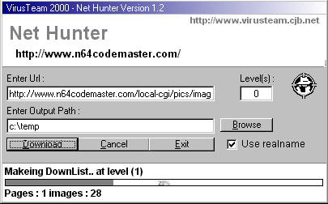



## Net Hunter

### Description

- *UPDATET* -

I just opdatet it so now there are 2 projects files, one for Visual Basic 5.0 and one for Visual Basic 6.0

just use the one called "Net Huter 5.0" for you that have Visual Basic 5.0, and i made a littel Treeview that lets you see what you found and where it to it from.

Oki i am back again, And YES.

Yet a time i made a VERY MESSY CODE! I know i should write comments, and some bla..bla..bla.. but i did't. Why ? well i am not here to win anyting just to give my code to share it with some else off need of the same function.

Oki to the Code : Net Hunter is a small program that connect to a web site useing the Inet1 control and downloads all the HTML and rips out the links, and Images. and downloads them for you.

well look at it if you like it tell me, if not well sorry..

Ohh yeah i use a function from one of you guys codes.

it is the one that check the listboxes for dups!

It removes entry if there are 2 a like.(sorry my english could be better) so that part is not my code.

CiX - VirusTeam 2000.
 
### More Info
 

             |
---                |---
**Submitted On**   |2000-11-23 16:05:22
**By**             |[CiX](https://github.com/Planet-Source-Code/PSCIndex/blob/master/ByAuthor/cix.md)
**Level**          |Intermediate
**User Rating**    |5.0 (10 globes from 2 users)
**Compatibility**  |VB 5\.0, VB 6\.0
**Category**       |[Internet/ HTML](https://github.com/Planet-Source-Code/PSCIndex/blob/master/ByCategory/internet-html__1-34.md)
**World**          |[Visual Basic](https://github.com/Planet-Source-Code/PSCIndex/blob/master/ByWorld/visual-basic.md)
**Archive File**   |[CODE\_UPLOAD1196711232000\.zip](https://github.com/Planet-Source-Code/cix-net-hunter__1-13026/archive/master.zip)

